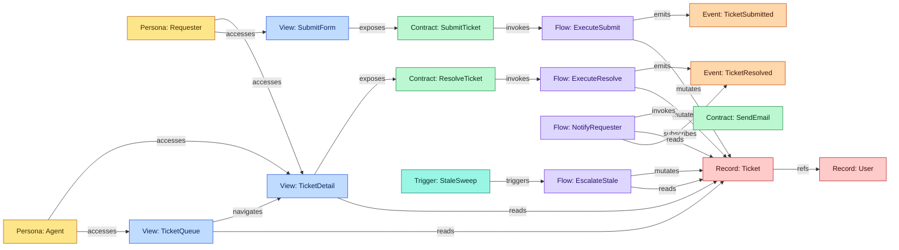
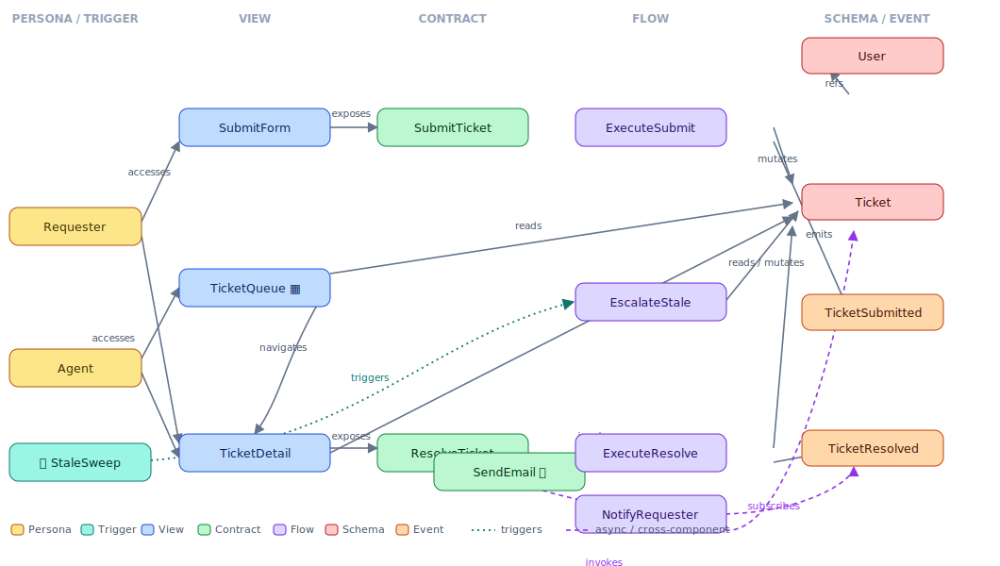

# Example: Helpdesk (multi-file, full v5 showcase)

A small support-ticket app that exercises **every** AIM v5.2 feature in one connected graph. It is intentionally split across files, because the point of the graph model is that the relation graph *spans files* — and you can still traverse, check, and diff it.

> The single-file [`nemicko.demo.todo.aim`](../nemicko.demo.todo.aim) shows the basics in one file. This example shows the graph at scale.

## The app

Requesters open support tickets from a form and track them. Agents work a shared **table** of all tickets, open one, and resolve it. Resolving a ticket emits an event that an asynchronous flow picks up to **email the requester**.

## What it showcases

| Feature | Where |
|---|---|
| All seven facets | `Record` ×2, `Contract` ×3, `Flow` ×4, `Persona` ×2, `View` ×3, `Event` ×2, `Trigger` ×1 |
| Child intents + parent-as-index | `submit/` and `resolve/` under `helpdesk.tickets`; parent holds shared schema, personas, views |
| All ten typed edges | `exposes`, `invokes`, `reads`, `mutates`, `emits`, `subscribes`, `accesses`, `navigates`, `triggers`, `refs` |
| Non-actor entry point | `Trigger: StaleSweep` (cron) `triggers` `Flow: EscalateStale` — a scheduled sweep with no Persona or View |
| Upward resolution | child intents write `[mutates](aim:#Record:Ticket)` — `Ticket` resolves up to the parent |
| Cross-component edges | parent → child (`...resolve#Contract:ResolveTicket`) and → external (`comms#Contract:SendEmail`) |
| Dependencies + mapping | `Imports`/`Requires` in the parent; `helpdesk.tickets.mapping.aim` binds the `Users` capability |
| Intent↔code bindings | `helpdesk.tickets.binding.aim` maps nodes to `file#symbol`, `route:`, `table:`, `topic:` |
| A table view and a form view | `View: TicketQueue` (table) and `View: SubmitForm` (form) |

## Layout

```
aim/
  helpdesk.tickets/
    helpdesk.tickets.aim            # parent: index, shared User+Ticket, personas, views, notify + escalate flows, StaleSweep trigger, deps
    helpdesk.tickets.mapping.aim    # Users capability → company.identity (facet: mapping)
    helpdesk.tickets.binding.aim    # intent → code, raises the component to Level 3 (facet: binding)
    submit/  helpdesk.tickets.submit.aim    # SubmitForm + SubmitTicket + ExecuteSubmit + TicketSubmitted
    resolve/ helpdesk.tickets.resolve.aim   # ResolveTicket + ExecuteResolve + TicketResolved
  comms/
    comms.aim                       # SendEmail — the external capability the notify flow invokes
```

## The graph

Every heading is a node; every `[verb](aim:…)` is a typed edge. Collected across the files, they form one graph (colored by facet type):



*(The contracts also declare `mutates`/`emits` as their observable guarantees — the flows then realize them. The diagram shows the flow-level edges to keep the chain readable; both are in the `.aim` files.)*

A standalone vector version of the same graph (facet columns, left-to-right) lives in [`graph.svg`](./graph.svg):



## Reading the graph

- **Submit path:** `Requester` *accesses* `SubmitForm`, which *exposes* `SubmitTicket`; the contract *invokes* `ExecuteSubmit`, which *mutates* `Ticket` and *emits* `TicketSubmitted`.
- **Resolve + notify (the async hop):** `Agent` opens `TicketDetail`, which *exposes* `ResolveTicket` → *invokes* `ExecuteResolve` → *mutates* `Ticket` + *emits* `TicketResolved`. Separately, `NotifyRequester` *subscribes* to `TicketResolved`, *reads* the `Ticket`, and *invokes* the external `comms.SendEmail`. Nothing *invokes* `NotifyRequester` — it is entered by the event, which is exactly why event-driven flows are not orphans.
- **Scheduled, non-actor path:** `StaleSweep` (a cron `Trigger`) *triggers* `EscalateStale`, which *reads* and *mutates* `Ticket`. No Persona or View is involved — the Trigger is the entry point, so the flow has a real inbound edge instead of looking orphaned. (External webhooks model the same way.)
- **Impact analysis for free:** changing `Record: Ticket` reaches **12** nodes along inbound edges — both contracts, all four flows (incl. the notify and escalate flows), all three views, both personas, and the `StaleSweep` trigger (transitively). That set is *computed* from the graph, not guessed.
- **Drift as graph-diff:** because `helpdesk.tickets.binding.aim` maps nodes to code (`SubmitTicket → src/tickets/submit.ts#submitTicket`, `Ticket → table:tickets`, `TicketResolved → topic:…`), a Reviewer can diff this declared graph against the realized code graph and report precise, owner-routed findings.
